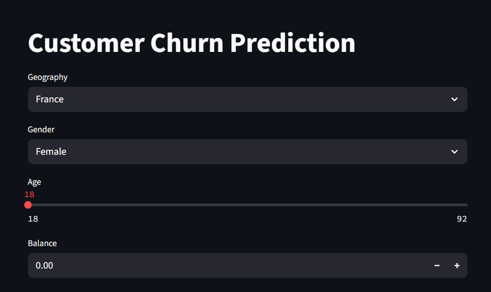

# 🧠 Customer Churn Prediction

A machine learning web app built using **TensorFlow**, **Scikit-learn**, and **Streamlit** to predict the likelihood of a customer leaving a bank. This project uses real-world data to help businesses take preventive action against customer churn.

---

### 🖼️ App Preview



---

## 📊 Problem Statement

Customer churn is a major problem in many industries, especially banking. Accurately predicting which customers are likely to leave allows companies to proactively retain them by offering incentives or improved services.

This project aims to:

- Build a deep learning model to predict churn.
- Create an interactive web interface for real-time predictions.

---

## 🚀 Demo

👉 **[[Live Demo](https://petitoacdrtsu8bqgbc4em.streamlit.app/)]**

---

## 🛠️ Tech Stack

| Component       | Technology                |
| --------------- | ------------------------- |
| Frontend        | Streamlit                 |
| Backend         | Python, TensorFlow        |
| Data Processing | Pandas, Scikit-learn      |
| Model           | Neural Network (Keras)    |
| Deployment      | Streamlit sharing / local |

---

## 📁 Project Structure

    ├── app.py  # Streamlit app
    ├── prediction.ipynb # Model training notebook
    ├── experiments.ipynb # Experiments with preprocessing and tuning
    ├── Churn_Modelling.csv # Dataset
    ├── model.h5 # Trained deep learning model
    ├── scaler.pkl # Scaler for input features
    ├── label_encoder_gender.pkl # LabelEncoder for Gender
    ├── onehot_encoder_geo.pkl # OneHotEncoder for Geography

---

## 🧪 How It Works

1. **User Input**: Customer details are entered through Streamlit.
2. **Preprocessing**: Input is encoded and scaled using pre-trained transformers.
3. **Prediction**: A trained TensorFlow model predicts the churn probability.
4. **Result**: Output shows whether the customer is likely to churn.

---

## 📉 Dataset

- **Source**: [Churn_Modelling.csv](./Churn_Modelling.csv)
- **Features include**:
  - Credit Score
  - Geography
  - Gender
  - Age
  - Tenure
  - Balance
  - Number of Products
  - Has Credit Card
  - Is Active Member
  - Estimated Salary
  - Exited (Target variable)

---

## 🧠 Model Details

- Model: Sequential Neural Network with Keras
- Activation: ReLU & Sigmoid
- Loss: Binary Crossentropy
- Optimizer: Adam
- Metrics: Accuracy

---

## ⚙️ How to Run Locally

1. Clone the repository:

```bash
git clone https://github.com/AbhinavRai2004/Customer-Churn-Prediction.git
cd Customer-Churn-Prediction
```
